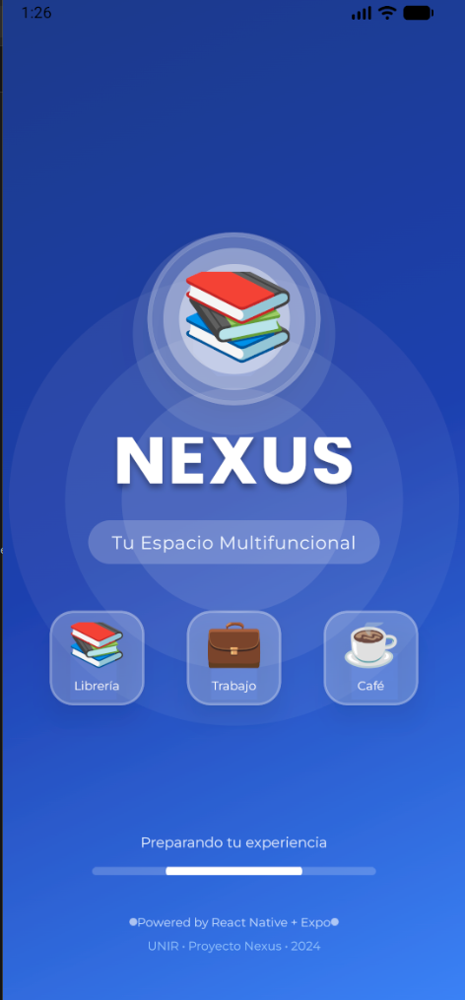
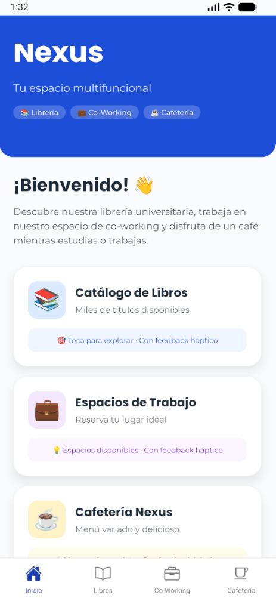
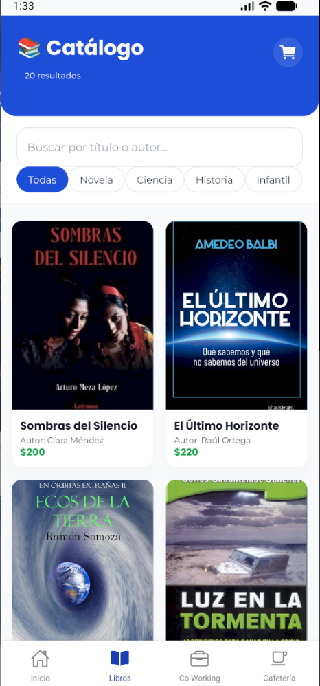
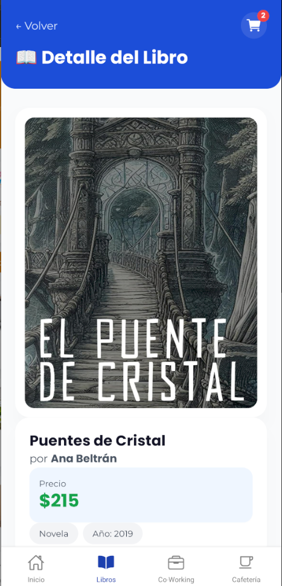
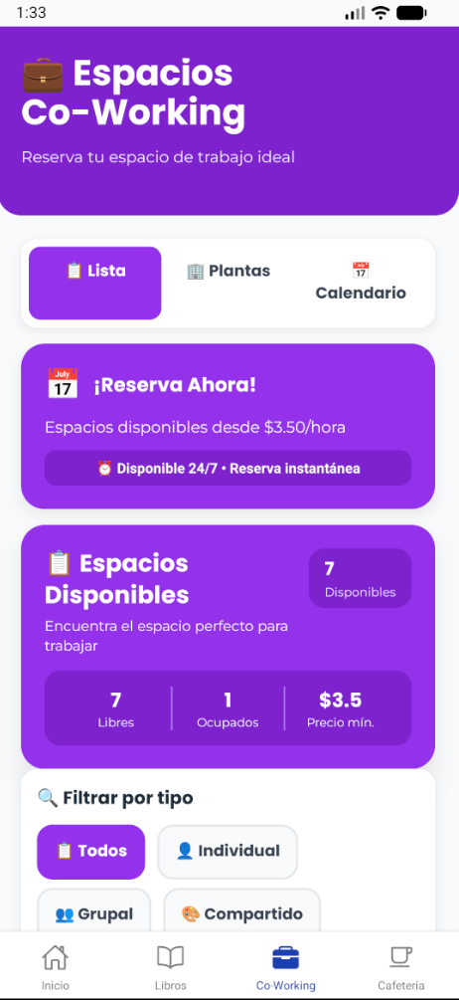
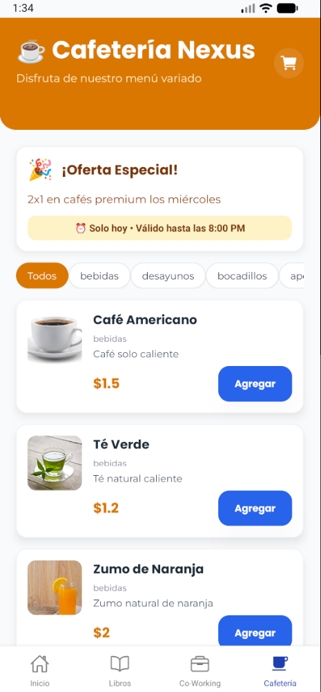
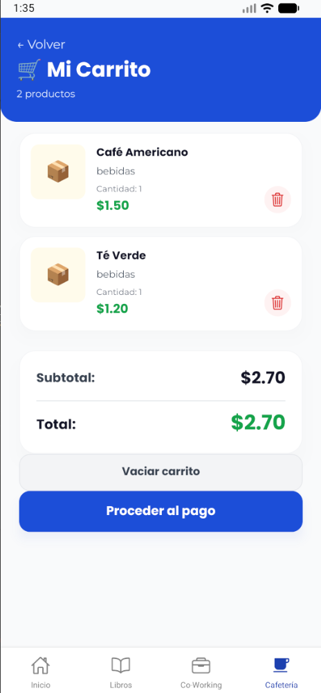

<div align="center">

# 📚 Nexus App

### Aplicación móvil multiplataforma para espacio universitario integral

[](https://reactnative.dev/)
[](https://expo.dev/)
[](https://www.nativewind.dev/)
[](https://www.javascript.com/)

<p align="center">
  
  
  
</p>

---

### 🎯 Proyecto del Máster en Desarrollo de Aplicaciones Móviles Multiplataforma - UNIR

**Actividad 3** | Desarrollo de Aplicación Móvil con React Native

---

</div>

## 📋 Tabla de Contenidos

- [Sobre el Proyecto](#-sobre-el-proyecto)
- [Características](#-características)
- [Capturas de Pantalla](#-capturas-de-pantalla)
- [Tecnologías](#️-tecnologías)
- [Instalación](#-instalación)
- [Uso](#-uso)
- [Estructura del Proyecto](#-estructura-del-proyecto)
- [Roadmap](#-roadmap)
- [Contribución del Equipo](#-contribución-del-equipo)
- [Problemas Conocidos](#-problemas-conocidos)
- [Recursos](#-recursos)
- [Licencia](#-licencia)

---

## 🚀 Sobre el Proyecto

**Nexus** es una aplicación móvil multiplataforma que integra tres servicios esenciales para la comunidad universitaria:

- 📚 **Librería Digital**: Catálogo de libros académicos con búsqueda y filtros
- 💼 **Co-Working**: Sistema de reserva de espacios de trabajo colaborativo
- ☕ **Cafetería**: Menú digital con carrito de compras y pedidos

### ✨ Características Destacadas

- ✅ **Navegación Completa**: Stack Navigator + Bottom Tabs con animaciones fluidas
- ✅ **Diseño Moderno**: NativeWind v4 (Tailwind CSS) para estilos consistentes
- ✅ **Retroalimentación Háptica**: Feedback táctil en todas las interacciones principales
- ✅ **Splash Screen Profesional**: Animaciones sincronizadas con audio de inicio
- ✅ **Fuentes Personalizadas**: Poppins y Montserrat para tipografía profesional
- ✅ **Responsive Design**: Adaptado para todo tipo de dispositivos móviles
- ✅ **Performance Optimizado**: `useNativeDriver` para animaciones a 60fps

---

## 📱 Capturas de Pantalla

<div align="center">

### 🎬 Splash Screen y Pantalla Principal

| Splash Screen | Landing Screen |
|:---:|:---:|
|  |  |
| *Animación de 8.5s con audio* | *Pantalla principal con haptics* |

### 📚 Sección Librería

| Catálogo de Libros | Detalle de Libro |
|:---:|:---:|
|  |  |
| *Catálogo con búsqueda y filtros* | *Información detallada del libro* |

### 💼 Co-Working y Servicios

| Espacios Co-Working | Cafetería | Carrito |
|:---:|:---:|:---:|
|  |  |  |
| *Reserva de espacios* | *Menú digital* | *Sistema de pedidos* |

</div>

---

## 🛠️ Tecnologías

### Core

| Tecnología | Versión | Descripción |
|------------|:-------:|-------------|
| **React Native** | 0.76.5 | Framework principal |
| **Expo SDK** | 52.0.0 | Plataforma de desarrollo |
| **React** | 18.2.0 | Librería UI |
| **React Navigation** | 6.1.18 | Navegación Stack + Tabs |

### UI/UX

| Librería | Versión | Uso |
|----------|:-------:|-----|
| **NativeWind** | 4.0.1 | Estilos con Tailwind CSS |
| **Expo Linear Gradient** | 13.0.2 | Gradientes en headers |
| **Expo Font** | 12.0.0 | Fuentes personalizadas |
| **Ionicons** | Incluido | Iconos de navegación |

### Interacción

| Paquete | Versión | Funcionalidad |
|---------|:-------:|---------------|
| **Expo Haptics** | 13.0.1 | Feedback táctil |
| **Expo AV** | 14.0.7 | Reproducción de audio |
| **React Native Reanimated** | 3.10.1 | Animaciones nativas |

---

## 📦 Instalación

### Prerrequisitos

Antes de empezar, asegúrate de tener instalado:

- [Node.js](https://nodejs.org/) v18 o superior
- [npm](https://www.npmjs.com/) o [yarn](https://yarnpkg.com/)
- [Git](https://git-scm.com/)
- **Expo Go** en tu móvil:
  - [Android - Google Play](https://play.google.com/store/apps/details?id=host.exp.exponent)
  - [iOS - App Store](https://apps.apple.com/app/expo-go/id982107779)

### Clonar e Instalar

```bash
# 1. Clonar el repositorio
git clone https://github.com/TU_USUARIO/Nexus-app-React-Native.git

# 2. Navegar al directorio
cd Nexus-app-React-Native

# 3. Instalar dependencias
npm install

# 4. Iniciar el servidor de desarrollo
npx expo start
```

---

## 🎮 Uso

### Opción 1: Expo Go (Recomendado) 📱

1. **Inicia el servidor:**
   ```bash
   npx expo start
   ```

2. **Escanea el código QR:**
   - **Android**: Abre Expo Go → Escanea el QR
   - **iOS**: Abre la Cámara → Escanea el QR

### Opción 2: Emulador Android 🤖

```bash
npx expo start --android
# O presiona 'a' en la terminal
```

### Opción 3: Simulador iOS 🍎 (Solo macOS)

```bash
npx expo start --ios
# O presiona 'i' en la terminal
```

### Scripts Disponibles

```bash
npm start          # Inicia el servidor de desarrollo
npm run android    # Abre en emulador Android
npm run ios        # Abre en simulador iOS (macOS)
npm run web        # Abre en navegador web
npx expo start -c  # Inicia con caché limpia
```

---

## 📁 Estructura del Proyecto

```
Nexus-app-React-Native/
│
├── 📱 App.js                        # Punto de entrada principal
├── 🎨 global.css                    # Estilos globales NativeWind
├── ⚙️ babel.config.js               # Configuración Babel + NativeWind
├── ⚙️ metro.config.js               # Configuración Metro bundler
├── 🎨 tailwind.config.js            # Config Tailwind (colores, fuentes)
├── 📋 package.json                  # Dependencias y scripts
├── 🚫 .gitignore                    # Archivos ignorados
└── 📖 README.md                     # Documentación (este archivo)

📂 src/
├── 🧭 navigation/
│   └── AppNavigator.js              # Stack + Tabs Navigator
│
├── 🖼️ screens/
│   ├── SplashScreen.js              # Splash con animaciones + audio
│   ├── LandingScreen.js             # Pantalla principal
│   ├── CatalogScreen.js             # Catálogo de libros
│   ├── BookScreen.js                # Detalle de libro
│   ├── CoWorkingScreen.js           # Espacios co-working
│   ├── CafeScreen.js                # Menú cafetería
│   └── CartScreen.js                # Carrito de compras
│
├── 🧩 components/
│   └── HapticButton.js              # Botón con feedback háptico
│
├── 🌐 services/
│   └── api.js                       # Servicios API simulada
│
├── 🪝 hooks/
│   └── useApi.js                    # Hook personalizado para API
│
├── 🎯 context/
│   └── CartContext.js               # Estado global del carrito
│
└── 📊 constants/
    ├── theme.js                     # Colores y estilos globales
    ├── coWorkingSpaces.js           # Datos de espacios
    └── cafeMenu.js                  # Menú de cafetería

📂 assets/
├── 🔤 fonts/                        # Poppins + Montserrat (.ttf)
└── 🎵 sounds/                       # Audio de splash (startup.mp3)
```

---

## ⚠️ Problemas Conocidos

### 🐛 Incompatibilidad SDK 54

**Problema:**
```
ERROR [WorkletsError: Mismatch between JavaScript (0.7.1) and native (0.5.1)]
```

**Causa:**
- Expo Go tiene Worklets 0.5.1 nativo (compilado)
- SDK 54 requiere Worklets 0.7.1
- React Navigation usa react-native-reanimated → Crash al navegar

**Solución aplicada:**
- ✅ Permanecer en Expo SDK 52
- ✅ Funciona perfectamente con todas las features necesarias

**Alternativa (no usada):**
- Compilar Development Build custom con `eas build`
- Requiere 30-60 min + cuenta EAS

---

### 🔧 Solución de Problemas Comunes

<details>
<summary><b>❌ Error: "Cannot find module" o dependencias rotas</b></summary>

```bash
# Windows
rmdir /s /q node_modules
del package-lock.json

# macOS/Linux
rm -rf node_modules package-lock.json

# Reinstalar
npm install
```
</details>

<details>
<summary><b>❌ NativeWind no aplica estilos (className no funciona)</b></summary>

1. Verifica que `global.css` esté importado en `App.js`
2. Verifica que `metro.config.js` exista
3. Verifica que `babel.config.js` tenga `"nativewind/babel"`
4. Reinicia con caché limpia:
   ```bash
   npx expo start -c
   ```
</details>

<details>
<summary><b>❌ Las fuentes no cargan</b></summary>

```bash
npx expo install expo-font
# Verifica que App.js tenga useFonts() y muestre "Cargando..." antes del render
```
</details>

<details>
<summary><b>❌ Metro bundler crashed</b></summary>

```bash
npx expo start -c --clear
# O reinicia el emulador/dispositivo
```
</details>

---

## 📚 Recursos

### Documentación Oficial

- 📖 [Expo Documentation](https://docs.expo.dev/)
- 🧭 [React Navigation](https://reactnavigation.org/docs/getting-started)
- 🎨 [NativeWind](https://www.nativewind.dev/)
- 📳 [Expo Haptics API](https://docs.expo.dev/versions/latest/sdk/haptics/)
- 🔤 [Google Fonts - Expo](https://github.com/expo/google-fonts)

### Tutoriales Útiles

- [React Native Tutorial](https://reactnative.dev/docs/tutorial)
- [Expo SDK 52 Release Notes](https://expo.dev/changelog/2024/11-12-sdk-52)
- [NativeWind v4 Migration Guide](https://www.nativewind.dev/v4/overview)

---

## 📄 Licencia

Este proyecto es parte del **Máster en Desarrollo de Aplicaciones Móviles Multiplataforma - UNIR**

**Actividad 3**: Desarrollo de una aplicación móvil multiplataforma

📅 **Fecha de entrega**: Diciembre 2025

⚖️ **Uso académico exclusivo** - No se permite uso comercial

---

## 🙏 Agradecimientos

- 👨‍🏫 **Profesores de UNIR** por su guía y material
- 💻 **Comunidad de React Native** por la documentación
- 🎨 **Expo Team** por las herramientas de desarrollo
- 📚 **Compañeros de equipo** por la colaboración

---

<div align="center">

### 🌟 ¿Te gusta el proyecto? Dale una estrella ⭐

[](https://github.com/TU_USUARIO/Nexus-app-React-Native)

---

**Desarrollado con ❤️ usando React Native, Expo y NativeWind**


*Última actualización: Diciembre 2025*

</div>
